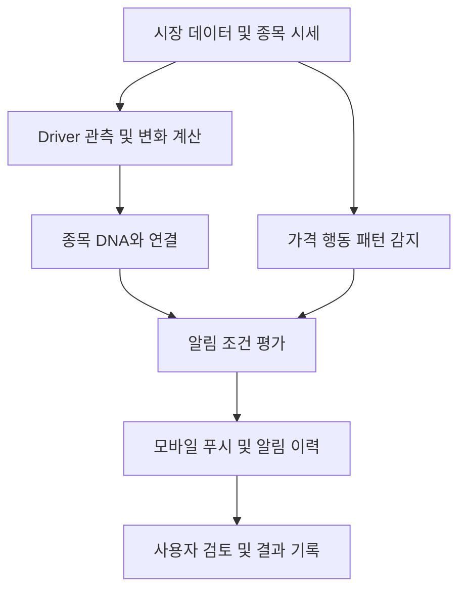

# TradingMetrix 단계별 구현 계획

## 목표와 초기 범위

종목의 가격에 영향을 주는 요인과 가격 행동을 분류하고, 관심 종목의 조건 변화에 따라 모바일 알림을 제공한다.

- 기본 프레임워크: 12개 Driver + 5개 가격 행동 패턴
- 첫 버전: 관심 종목 관리, 종목 분류 조회, 가격 알림, 푸시 수신
- 후속 확장: Driver 알림, 패턴 감지, 복합 조건 알림
- 증권사 주문 연동은 별도 단계에서 검토한다.

## 기본 개념

기업의 사업 분류와 주가가 반응하는 요인을 구분한다. 종목 분류는 검증 가능한 가설로 시작하며, 관측 데이터에 따라 갱신한다.

### 12개 Driver

| Driver | 초기 데이터 정의 방향 |
| --- | --- |
| 금리 | 국채 금리 등 관측 지표 |
| 유동성 | 대리 지표와 갱신 주기 정의 필요 |
| Nasdaq Risk-on | Nasdaq 관련 지수 또는 ETF 변화 |
| VIX / Risk-off | 변동성 지표 변화 |
| 경기 | 경제 지표 및 발표 일정 |
| 달러 | 달러 관련 지표 변화 |
| 유가 | 원유 가격 변화 |
| 금·금속 | 금 및 관련 금속 가격 변화 |
| Bitcoin / Crypto | BTC 등 암호자산 가격 변화 |
| AI CAPEX | 기업 투자 발표 등 대리 지표 정의 필요 |
| 소비 | 소비 관련 경제 지표 및 기업 데이터 |
| 개별 실적 | 기업 실적 발표 및 관련 이벤트 |

### 5개 가격 행동 패턴

| 패턴 | 개념 |
| --- | --- |
| Trend | 추세 지속 |
| Mean Reversion | 기준 수준으로의 평균회귀 |
| Momentum | 가격과 거래량을 동반한 움직임 강화 |
| Shock → Decay | 급격한 반응 이후 움직임 약화 |
| Event Repricing | 이벤트 이후 가격 수준 재평가 |

패턴별 분석 시간 단위, 관찰 구간, 감지 조건과 해제 조건은 구현 전에 명시한다. 종목의 기본 패턴 성향과 현재 감지된 패턴은 별도로 저장한다.

## 1단계: 분류 체계와 데이터 모델 확정

종목 DNA를 일관된 데이터 구조로 정의한다.

- 종목 식별 정보: 티커, 거래소, 통화, 업종
- 주요 Driver와 보조 Driver
- Driver별 민감도와 반응 방향
- 기본 가격 행동 성향
- Catalyst: 실적, 계약, 정책 등 이벤트
- 분석 기간, 분류 근거, 출처, 갱신 시점
- 현재 감지된 패턴과 감지 근거

민감도 점수와 반응 방향을 분리한다. 초기 민감도는 수동 가설로 등록하고, 미확인 값은 0과 구분한다. 분석 기간이나 시장 상황에 따라 관계가 달라질 수 있도록 기록한다.

**산출물:** 종목 데이터 명세, Driver 정의서, 예시 종목 10개 분류표.

**완료 기준:** 예시 종목을 같은 기준으로 분류하고 비교할 수 있다.

## 2단계: 모바일 화면과 사용 흐름 구현

샘플 데이터로 주요 화면과 탐색 흐름을 구현한다.

1. 시장 현황: Driver의 현재 상태와 변화
2. 관심 종목: 종목별 DNA와 시세 요약
3. 종목 상세: Driver, 패턴, Catalyst, 분류 근거
4. 알림 설정: 조건, 적용 시간, 반복 설정
5. 알림 이력: 발생 조건과 당시 데이터

**산출물:** 모바일 화면 프로토타입과 핵심 사용자 흐름.

**완료 기준:** 휴대폰 화면에서 종목 추가, DNA 확인, 알림 설정을 끝까지 실행할 수 있다.

## 3단계: 시세 연결과 가격 알림 구현

시세 제공자의 지원 시장, 갱신 주기, 비용을 확인하고 데이터 수집을 연결한다. 앱이 닫혀 있어도 동작하도록 서버에서 조건을 평가하고 모바일 푸시를 발송한다.

- 가격 돌파 및 이탈 알림
- 기준 가격 대비 등락률 알림
- 장전, 정규장, 장후 적용 범위
- 데이터 시점과 지연 상태 표시
- 중복 발송 방지와 재알림 간격
- 푸시 권한 상태, 발송 결과 및 실패 기록

**산출물:** 시세 수집, 가격 조건 평가, 실제 기기 푸시, 알림 이력.

**완료 기준:** 테스트 조건 충족 시 실제 기기로 푸시가 도착하고 발송 이력이 남는다.

**첫 MVP 범위는 1~3단계로 한다.**

## 4단계: Driver 기반 관찰과 알림 추가

측정 가능한 Driver부터 연결한다. 금리, 달러, VIX, BTC 등은 관측값을 사용하고, 유동성, AI CAPEX, 소비 등은 대리 지표와 갱신 주기를 정한다.

- Driver 변화 임계값 설정
- 관련 관심 종목 조회
- 종목과 Driver의 연결 근거 표시
- 수동 분류와 관측 결과 비교
- 데이터 부족 및 오래된 데이터 상태 표시

**산출물:** Driver 대시보드와 Driver 조건 알림.

**완료 기준:** Driver 조건으로 알림을 받고, 사용된 데이터와 종목 연결 근거를 확인할 수 있다.

## 5단계: 가격 행동 패턴 감지 구현

추세와 모멘텀부터 구현하고, 평균회귀, 충격 후 소멸, 이벤트 재평가를 순차적으로 추가한다.

- 패턴별 분석 시간 단위와 관찰 구간 정의
- 가격 및 거래량 조건 정의
- 감지, 유지, 해제 조건 정의
- 이벤트 데이터와 가격 반응 연결
- 과거 데이터 검증 및 실시간 모의 운영
- 오탐률과 감지 지연 평가

**산출물:** 패턴 감지 규칙, 검증 결과, 감지 근거 화면.

**완료 기준:** 패턴 이름, 감지 시점, 충족 조건을 표시하고 규칙의 성능을 평가할 수 있다.

## 6단계: 복합 알림과 개인화 완성

사용자가 Driver, 가격, 거래량, 패턴 조건을 조합해 관찰 전략을 저장하도록 한다.

예시 조건: `Driver 변화 AND 가격 돌파 AND 거래량 증가`.

- 조건 간 AND / OR 조합과 평가 구간
- 종목별 설정 및 알림 우선순위
- 조용한 시간과 반복 제한
- 발생 당시 데이터 스냅샷
- 알림 이후 결과와 사용자 평가 기록

**산출물:** 복합 조건 편집, 개인 설정, 결과 검토 흐름.

**완료 기준:** 관찰 전략을 저장하고 알림 발생 이유와 이후 결과를 이력에서 검토할 수 있다.

## 시스템 구성

| 구성 요소 | 역할 |
| --- | --- |
| 모바일 앱 | 관심 종목, DNA 조회, 알림 설정과 수신 |
| 데이터 수집 서버 | 시세, Driver 지표, 이벤트 수집 및 정규화 |
| 데이터 저장소 | 종목 분류, 관측값, 사용자 설정, 알림 이력 저장 |
| 조건 평가 엔진 | 가격, Driver, 패턴, 복합 조건 평가 |
| 푸시 발송 시스템 | 기기별 전달, 중복 방지, 발송 결과 기록 |

모바일 프레임워크, 데이터 공급자, 서버 및 저장소 기술은 지원 시장과 필요한 갱신 주기를 확인한 뒤 선택한다.

## 다음 작업

1. 종목 데이터 명세와 Driver 점수·방향 기준 작성
2. 예시 종목 10개 분류
3. 첫 MVP의 화면 흐름 구체화
4. 지원 시장, 플랫폼, 시세 갱신 주기 확정

이 문서는 초기 구현 계획이며, 종목별 민감도나 패턴의 예측 성능이 검증되었다는 의미는 아니다.
