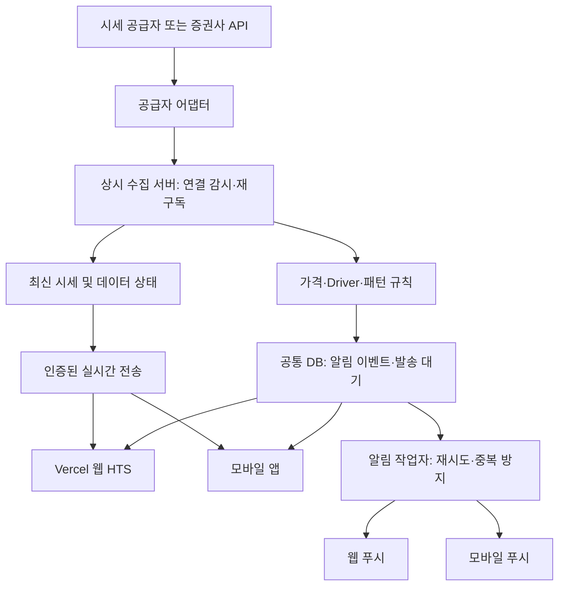

# 개인 HTS 및 실시간 모니터링 오픈소스 조사

조사일: 2026-10-03

## 조사 범위와 근거

GitHub 저장소의 공개 README, 파일 구조, 공식 API 문서를 확인했다. 프로젝트를 설치하거나 실시간 피드를 실행하지 않았으므로, 지연·안정성·처리량은 검증되지 않았다. 검색 결과의 설명과 실제 README가 다른 경우 README의 현재 설명을 우선했다. 아래 운영 권고는 조사 내용을 바탕으로 한 TradingMetrix 설계 판단이다.

## 사례 비교

| 사례 | 구현 방식 | 참고할 점 | 적용 시 한계 |
| --- | --- | --- | --- |
| Edge Scanner | 개인 컴퓨터에서 Python 수집·스캔 프로세스 실행, 브라우저 대시보드, Alpaca/Schwab 연결 | 공급자 인터페이스, 조건식 조합, 알림 근거 설명, WebSocket 알림 전달 | 로컬 사용 전제. 핵심 스캔은 1분봉 기반으로 체결 단위 즉시 알림과 구분 필요 |
| us-stock-radar | Alpaca 스트림, 규칙 엔진, AI 작업자, 알림 작업자 분리. SQLite WAL 상태를 작업 큐로 활용 | 중요 종목 스트리밍, 나머지 폴링, 규칙 이벤트 이후 AI 분석 | 단일 사용자이며 인증 없음. 공개 서비스와 다중 서버 운영에는 재설계 필요 |
| Market-Terminal | Next.js, Supabase, Lightweight Charts, Alpaca, Vercel | Vercel 웹 화면과 인증·관심 종목 관리 구성 | README에서 브라우저에 Alpaca 키·시크릿 노출. 공유 서비스에 그대로 적용하지 않음 |
| crypto-alert-bot | FastAPI에서 스트림 수신·가격 조건 평가, 웹 WebSocket, Telegram 알림 | 수집·평가·전달의 작은 전체 예제 | 암호자산 대상. 모바일 네이티브 푸시와 발송 재시도는 별도 구현·검증 필요 |
| python-kis | 한국투자증권 커뮤니티 Python 라이브러리 | 재연결·구독 복원, 국내·해외 실시간 체결 콜백 | 구독 복원과 단절 구간 이벤트 복구는 별개의 요구사항 |
| KIS 공식 샘플 | REST와 WebSocket 예제, 인증 공통 코드 | 국내·해외 주식 연결의 공식 기준 | 완성된 HTS 운영 서버가 아니라 API 연결 예제 |
| Pairlens | 브라우저/데스크톱에서 공급자에 직접 연결하는 로컬 우선 터미널 | 공급자 플러그인, 여러 화면을 공유하는 단일 코드베이스 | 기기가 꺼진 동안의 중앙 알림 요구는 별도 서버 필요. source-available로 소개되므로 재사용 전 라이선스 확인 |
| OpenCharts | 브라우저에서 과거 OHLC를 재생하는 모의매매 터미널 | 화면 구성과 차트 상호작용 | 실제 실시간 시세 서비스가 아님. 알림은 세션 내 토스트·소리이며 오프라인 전달 없음 |

## 사례별 출처

### Edge Scanner

출처: https://github.com/simonro/edge-scanner

README는 단일 프로세스와 하나의 시장 데이터 WebSocket, DataFeed 인터페이스, AND/OR 등 조건 조합, 로컬 알림 WebSocket을 설명한다. 기본 Alpaca SIP에는 유료 데이터가 필요하며 IEX만 사용하면 거래량 기반 스캔 결과가 달라진다고 명시한다. Schwab 대안은 계좌 및 인증 조건이 있고, 일부 봉은 호가로 구성한다. 계좌 이용 가능성과 데이터 권한은 별도 확인해야 한다.

### us-stock-radar

출처: https://github.com/BDMisME/us-stock-radar

수집, 지표 계산, 신호 감지, AI 분석, 알림 발송을 분리한다. 초기 과거 데이터 보충과 재접속을 설명한다. Telegram/Email 알림을 제공한다. TradingMetrix에서는 이 책임 분리를 참고하되 공유 DB와 사용자별 권한을 도입한다.

### Market-Terminal

출처: https://github.com/alexmekhail/Market-Terminal

Vercel에 배포하는 Next.js 웹 HTS에 가까운 사례다. README에 브라우저용 NEXT_PUBLIC_ALPACA_API_KEY와 NEXT_PUBLIC_ALPACA_API_SECRET 설정이 있으므로, 공개 서비스의 공용 공급자 키를 이 방식으로 노출하지 않는다. 웹 화면과 서버 REST 프록시 구성은 참고 가능하다.

### crypto-alert-bot

출처: https://github.com/marketcalls/crypto-alert-bot

FastAPI 기반 서버, 시세 수집 서비스, 알림 엔진, 알림 전달 모듈, 웹 WebSocket을 구분한다. 기본 SQLite와 운영 PostgreSQL 설정을 설명한다. 로컬 소리와 Telegram은 모바일 앱 푸시와 구분한다.

### 한국투자증권 연결

- 공식 샘플: https://github.com/koreainvestment/open-trading-api
- 공식 API 안내: https://apiportal.koreainvestment.com/apiservice
- 커뮤니티 라이브러리: https://github.com/Soju06/python-kis

공식 샘플은 국내·해외 상품별 REST/WebSocket 예제를 제공한다. python-kis는 재연결과 구독 복원을 설명한다. 공급자 피드의 범위, 거래 시간, 동시 구독 제한, 호출 제한, 시세 비용, 표시·재배포 권한은 실제 사용 조건으로 확인한다. 증권사 API를 통합 미국 시장 SIP와 동등한 것으로 가정하지 않는다.

### 기타 터미널과 차트

- Pairlens: https://github.com/Pairlens/trading-terminal
- OpenCharts: https://github.com/dylanpersonguy/OpenCharts
- Lightweight Charts: https://github.com/tradingview/lightweight-charts

오픈소스 화면과 무료 실시간 데이터는 별개의 문제다. 소스가 공개되어 있어도 라이선스가 상용 서비스에 필요한 권한을 모두 주는지 확인한다. 코드 도입 시 각 라이브러리의 라이선스와 표시 의무를 확인한다.

## TradingMetrix에 적용할 구조

### 도입할 패턴

1. 공급자 연결을 어댑터로 분리한다. 가격, 호가, 봉, 장 구분, 이벤트 시각과 데이터 출처를 정규화한다.
2. 가격 돌파는 필요한 체결 이벤트로 평가하고, 추세·모멘텀은 명시한 봉 단위로 평가한다.
3. 관심 종목의 합집합을 구독하되 공급자 제한과 사용자 권한을 반영한다.
4. 초기 과거 봉을 로드하고 실시간 업데이트를 연결한다. 연결 복원 시 구독과 데이터 상태를 복구한다.
5. 규칙 엔진이 알림을 생성하고 AI는 이후 해석을 담당한다. 푸시를 AI 응답 완료에 종속시키지 않는다.
6. 알림 이벤트와 발송 대기를 영속 저장하고 채널별 발송 결과를 기록한다.
7. 체결 이벤트 처리와 화면 갱신을 분리한다. 화면용 갱신 병합으로 가격 돌파 감지가 누락되지 않게 한다.
8. 시세 출처 전환 시 피드 차이를 표시하고 지표 기준을 재설정한다. 폴링 데이터는 스트리밍과 같은 품질로 취급하지 않는다.

### 초기 기술 선택 제안

- 웹: Next.js + Vercel
- 차트: Lightweight Charts
- 상시 서버: Python + FastAPI, Docker 기반 배포
- DB와 인증: PostgreSQL + Supabase
- 시세: 미국 주식은 Alpaca 통합 피드와 증권사 API를 비교. 국내 주식은 KIS를 우선 연결 후보로 검토
- 알림: 웹 실시간 이벤트 + 웹 푸시 + 모바일 FCM/APNs 경로
- 초기 큐: PostgreSQL 발송 대기 테이블. 처리량 측정 후 별도 큐나 Redis 검토

최저 서버 요금제의 적합성은 종목 수, 이벤트량, 동시 접속 부하 측정으로 판단한다. 단일 서버는 초기 운영 구성이며 고가용성 보장은 아니다.

## 다음 검증 작업

1. 동일한 10~20개 종목으로 공급자별 체결·호가·봉을 비교한다.
2. 이벤트 시각과 서버 수신 시각으로 지연의 p50/p95/p99를 기록한다.
3. 강제 연결 단절 후 재접속, 재구독, 단절 구간 복구 가능 범위를 확인한다.
4. 재시작과 재시도 상황에서 알림 유실·중복을 검증한다.
5. 장전·정규장·장후와 거래 정지·저유동성 상황을 구분한다.
6. 웹을 닫은 상태에서도 서버 평가와 모바일 푸시가 동작하는지 확인한다.
7. 실제 공급자 계약의 앱 표시·재배포·비표시 분석 권한과 비용을 확인한다.

재구독 성공만으로 단절 중의 체결 이벤트가 복구되었다고 판정하지 않는다. 과거 조회가 봉만 제공한다면 체결 순서와 모든 조건의 발생 여부를 완전히 재현할 수 없는 경우가 있다.
